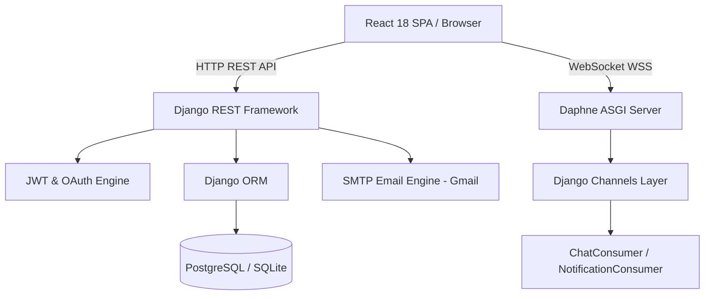

# ServiceHub — Master System Documentation 🛠️

Welcome to the official master technical documentation for **ServiceHub**, an end-to-end web platform connecting customers with verified local service professionals (plumbers, electricians, home repair technicians, appliance specialists, beauty experts, etc.).

This document serves as the single source of truth for the entire architecture, database design, REST API endpoints, real-time WebSockets, authentication mechanisms, frontend workflows, admin management tools, email engine, testing suites, and deployment guidelines.

---

## 📐 Table of Contents

1. [Executive Summary & Core Objectives](#1-executive-summary--core-objectives)
2. [Technology Stack & System Architecture](#2-technology-stack--system-architecture)
3. [Database Schema & Data Models](#3-database-schema--data-models)
4. [Authentication & Authorization Infrastructure](#4-authentication--authorization-infrastructure)
5. [Real-Time WebSockets & Messaging Engine](#5-real-time-websockets--messaging-engine)
6. [Complete REST API Catalog](#6-complete-rest-api-catalog)
7. [Frontend Architecture & Page Workflows](#7-frontend-architecture--page-workflows)
8. [Admin Management & Financial Analytics](#8-admin-management--financial-analytics)
9. [Email & Communication Subsystem](#9-email--communication-subsystem)
10. [Management Commands & Seeding](#10-management-commands--seeding)
11. [Testing & Quality Assurance](#11-testing--quality-assurance)
12. [Environment Setup & Installation Guide](#12-environment-setup--installation-guide)
13. [Edge Cases, Error Handling & Security Controls](#13-edge-cases-error-handling--security-controls)

---

## 1. Executive Summary & Core Objectives

### 1.1 Mission Statement
ServiceHub bridges the gap between home service providers and customers seeking verified, reliable local services. The platform eliminates friction in discovering services, scheduling appointments, negotiating rates, communicating in real-time, completing payments, and rating service quality.

### 1.2 User Roles & Target Audiences
1. **Customers**: Search local service professionals, select availability slots, attach problem photos and descriptions, manage bookings, pay via multiple methods (Card, Cash, UPI), chat in real time with providers, and post post-service reviews.
2. **Service Professionals (Providers)**: Register skills, city, pricing (Hourly vs Fixed), manage weekly availability schedules, receive job requests, accept/complete/cancel bookings, upload portfolio photo galleries, track earnings and analytics, and communicate with clients.
3. **System Administrators (Staff/Superusers)**: Oversee platform statistics, calculate total revenue and 10% platform commission, verify new provider applications, manage system-wide users (block/unblock accounts), view all bookings, and edit the master service catalog categories.

---

## 2. Technology Stack & System Architecture

### 2.1 Backend Architecture
- **Framework**: Django 5.x & Django REST Framework (DRF)
- **ASGI & WebSockets**: Daphne + Django Channels 4.x (`InMemoryChannelLayer` for development, scalable to Redis)
- **Authentication**: `rest_framework_simplejwt` (Custom JWT claims with role & email metadata) + Google OAuth 2.0
- **Database**: PostgreSQL (Production) with SQLite local dev fallback (`db.sqlite3`)
- **Email Delivery**: Custom SSL-unverified Gmail SMTP backend (`SSLUnverifiedEmailBackend`)
- **Media File Storage**: Django FileSystemStorage under `media/` (`profile_pics/`, `portfolio_pics/`, `booking_photos/`)

### 2.2 Frontend Architecture
- **Framework**: React 18+ bundled with Vite
- **Routing**: React Router DOM v6 with code-splitting via `React.lazy` and `Suspense`
- **Styling**: Vanilla CSS, Tailwind CSS, and custom glassmorphism design tokens
- **Iconography**: Lucide React (`lucide-react`)
- **Charts & Visualizations**: Recharts (`ResponsiveContainer`, `BarChart`, `PieChart`, `AreaChart`, `Tooltip`)
- **HTTP Client**: Axios instance with Request Interceptor for automatic Bearer JWT injection
- **Google Authentication**: `@react-oauth/google` integration

### 2.3 Standalone Marketing Landing Page
- Located in `landing/` (`index.html`, `styles.css`, `script.js`) for lightweight marketing presence outside the SPA router.

### 2.4 High-Level System Architecture Diagram



---

## 3. Database Schema & Data Models

### 3.1 `accounts` App

#### `CustomUser` (Extends `AbstractUser`)
Stores authentication metadata and global user attributes.
| Field Name | Type | Description |
|---|---|---|
| `id` | BigAutoField (PK) | Primary Key |
| `is_customer` | BooleanField (default: False) | Flag identifying customer access |
| `is_provider` | BooleanField (default: False) | Flag identifying provider access |
| `gender` | CharField (M/F/O, choices) | Optional user gender |
| `birth_date` | DateField | Optional date of birth |
| `is_email_verified` | BooleanField (default: False) | Account activation status via OTP |
| `email_verification_code` | CharField(6) | 6-digit email OTP |
| `email_verification_created_at` | DateTimeField | Timestamp for OTP expiry calculation (120s limit) |
| `password_reset_code` | CharField(6) | 6-digit password reset OTP |
| `password_reset_created_at` | DateTimeField | Timestamp for reset OTP expiry calculation (300s limit) |

#### `CustomerProfile`
| Field Name | Type | Description |
|---|---|---|
| `id` | BigAutoField (PK) | Primary Key |
| `user` | OneToOneField(`CustomUser`) | Linked user account |
| `phone_number` | CharField(15) | Customer contact phone number |

#### `ProviderProfile`
| Field Name | Type | Description |
|---|---|---|
| `id` | BigAutoField (PK) | Primary Key |
| `user` | OneToOneField(`CustomUser`) | Linked user account |
| `bio` | TextField | Provider bio / description |
| `phone_number` | CharField(15) | Professional contact number |
| `city` | CharField(100) | Operating city |
| `latitude` | FloatField | GPS latitude (auto-calculated from `CITY_COORDINATES` if missing) |
| `longitude` | FloatField | GPS longitude (auto-calculated from `CITY_COORDINATES` if missing) |
| `is_verified` | BooleanField (default: False) | Admin verification status |
| `profile_picture` | ImageField | Uploaded profile picture |
| `available_days` | CharField(200) | CSV string of operating days |
| `start_time` | TimeField (default: 09:00:00) | Standard shift start |
| `end_time` | TimeField (default: 17:00:00) | Standard shift end |
| `skills` | TextField | Key skills summary |
| `experience_years` | PositiveIntegerField | Total years of experience |

> **Automatic Geolocation Fallback**: When a provider selects a city from India's top 26 cities (e.g. Mumbai, Delhi, Bengaluru, Pune, Ahmedabad), `ProviderProfile.save()` automatically assigns base latitude and longitude coordinates with a minor hash offset so providers appear distinct on maps.

#### `ProviderGalleryImage`
| Field Name | Type | Description |
|---|---|---|
| `id` | BigAutoField (PK) | Primary Key |
| `provider` | ForeignKey(`ProviderProfile`) | Target provider profile |
| `image` | ImageField | Portfolio photograph |
| `uploaded_at` | DateTimeField (auto_now_add) | Upload timestamp |

---

### 3.2 `services` App

#### `Category`
| Field Name | Type | Description |
|---|---|---|
| `id` | BigAutoField (PK) | Primary Key |
| `name` | CharField(100) | Category title (e.g., Home Services, Personal & Beauty) |
| `description` | TextField | Description of services in category |
| `icon` | CharField(50) | UI icon name string |

#### `Service`
| Field Name | Type | Description |
|---|---|---|
| `id` | BigAutoField (PK) | Primary Key |
| `category` | ForeignKey(`Category`) | Parent category |
| `name` | CharField(100) | Service title (e.g., Web Developer, Plumber, Electrician) |
| `description` | TextField | Service description |
| `default_pricing_type` | CharField (`hourly`, `fixed`) | Profession-appropriate default billing mode (`fixed` for Web Dev, Graphic Design, Painter, Salon; `hourly` for Plumber, Electrician, Tutor) |

#### `ProviderService`
Links a provider to a specific service with custom pricing. Unique constraint on `(provider, service)`.
| Field Name | Type | Description |
|---|---|---|
| `id` | BigAutoField (PK) | Primary Key |
| `provider` | ForeignKey(`ProviderProfile`) | Offering provider |
| `service` | ForeignKey(`Service`) | Target service |
| `price` | DecimalField(max_digits=10, decimal_places=2) | Service price in INR (₹) |
| `pricing_type` | CharField choices (`hourly`, `fixed`) | Billing metric (Hourly Rate vs Fixed Charge) |

#### `Booking`
Core booking entity representing job contracts between customer and provider.
| Field Name | Type | Description |
|---|---|---|
| `id` | BigAutoField (PK) | Primary Key |
| `customer` | ForeignKey(`CustomerProfile`) | Booking customer |
| `provider_service` | ForeignKey(`ProviderService`) | Booked service offering |
| `booking_date` | DateTimeField | Scheduled appointment date and time |
| `address` | TextField | Service location address |
| `status` | CharField (`pending`, `accepted`, `completed`, `cancelled`) | Job state lifecycle |
| `payment_status` | CharField (`unpaid`, `paid`) | Settlement status |
| `payment_method` | CharField (`card`, `cash`, `upi`) | Selected payment mode |
| `problem_photo` | ImageField | Photo attachment of home repair issue |
| `problem_description` | TextField | Customer job notes |
| `created_at` | DateTimeField (auto_now_add) | Creation timestamp |

#### `Review`
One-to-One rating associated with a completed `Booking`.
| Field Name | Type | Description |
|---|---|---|
| `id` | BigAutoField (PK) | Primary Key |
| `booking` | OneToOneField(`Booking`) | Associated completed booking |
| `rating` | IntegerField (1 to 5) | Numerical star rating |
| `comment` | TextField | Review feedback text |
| `created_at` | DateTimeField (auto_now_add) | Submission timestamp |

#### `Message`
Real-time chat log entry attached to a `Booking`.
| Field Name | Type | Description |
|---|---|---|
| `id` | BigAutoField (PK) | Primary Key |
| `booking` | ForeignKey(`Booking`) | Parent booking thread |
| `sender` | ForeignKey(`CustomUser`) | Message author |
| `content` | TextField | Text body |
| `timestamp` | DateTimeField (auto_now_add) | Sent timestamp |
| `is_read` | BooleanField (default: False) | Read status indicator |

#### `Notification`
Dynamic system alert for users.
| Field Name | Type | Description |
|---|---|---|
| `id` | BigAutoField (PK) | Primary Key |
| `user` | ForeignKey(`CustomUser`) | Recipient user |
| `title` | CharField(255) | Alert headline |
| `message` | TextField | Full message text |
| `is_read` | BooleanField (default: False) | Read flag |
| `link` | CharField(255) | Optional target router link |
| `created_at` | DateTimeField (auto_now_add) | Timestamp |

#### `ProviderAvailability`
Provider weekly day-by-day availability slots. Unique constraint on `(provider, day_of_week)`.
| Field Name | Type | Description |
|---|---|---|
| `id` | BigAutoField (PK) | Primary Key |
| `provider` | ForeignKey(`ProviderProfile`) | Parent provider |
| `day_of_week` | IntegerField (0 = Mon, ..., 6 = Sun) | Day of week index |
| `start_time` | TimeField | Shift start time |
| `end_time` | TimeField | Shift end time |
| `is_available` | BooleanField (default: True) | Working availability toggle |

---

## 4. Authentication & Authorization Infrastructure

### 4.1 SimpleJWT Custom Token Engine
ServiceHub uses `rest_framework_simplejwt` with `CustomTokenObtainPairSerializer` to embed user context directly inside the JWT Access payload:
```json
{
  "token_type": "access",
  "exp": 1754514644,
  "user_id": 14,
  "username": "patel_shyam",
  "email": "shyam@example.com",
  "is_customer": true,
  "is_provider": false,
  "is_staff": false,
  "is_superuser": false,
  "is_email_verified": true
}
```

### 4.2 OTP Email Verification Flow
1. User registers via `POST /api/accounts/register/`.
2. A random 6-digit OTP code is generated, stored in `email_verification_code`, and `email_verification_created_at` is set to `timezone.now()`.
3. An HTML email with the OTP is dispatched via `send_otp_html_email()`.
4. The user verifies by posting `{ username, code }` to `POST /api/accounts/verify-email/`.
5. **Strict Expiry**: The code expires in **120 seconds (2 minutes)**.

### 4.3 Password Reset Flow
1. User submits username or email to `POST /api/accounts/forgot-password/`.
2. A 6-digit code is generated and saved in `password_reset_code` with timestamp `password_reset_created_at`.
3. A styled HTML email is sent to the user's email address.
4. User completes reset via `POST /api/accounts/reset-password/` with `{ username, code, new_password }`.
5. **Strict Expiry**: The password reset OTP expires in **300 seconds (5 minutes)**.

### 4.4 Google OAuth 2.0 Integration (`GoogleLoginAPIView`)
The system supports dual Google sign-in methods seamlessly:
- **Implicit Flow (`access_token`)**: Fetches user info from `https://www.googleapis.com/oauth2/v3/userinfo`.
- **Credential / ID Token Flow (`credential` or `token`)**: Verifies ID token locally using `google-auth` library, with HTTP fallback to `https://oauth2.googleapis.com/tokeninfo?id_token=...`.
- Existing accounts are protected from accidental role overwrites (e.g. a registered customer cannot log into provider mode using the same Google email without proper role switching).

### 4.5 Role Switching API (`SwitchRoleAPIView`)
Authenticated dual-role users can toggle their active role between `customer` and `provider` via `POST /api/accounts/switch-role/`.

---

## 5. Real-Time WebSockets & Messaging Engine

### 5.1 Custom ASGI Middleware (`JwtAuthMiddleware`)
WebSockets authenticate connection attempts using JWT tokens passed either via:
- Request Query Parameter: `ws://localhost:8000/ws/chat/1/?token=<jwt_access_token>`
- HTTP Header: `Authorization: Bearer <jwt_access_token>`

If valid, `scope['user']` is set to the authenticated `CustomUser`. Anonymous connections are rejected immediately (`close()`).

### 5.2 `ChatConsumer` (`ws/chat/<booking_id>/`)
- **Connection Security**: Verifies if the authenticated user is either the booking's customer or the offering provider. If neither, connection closes immediately.
- **Group Name**: `chat_<booking_id>`
- **Persistence**: Incoming message payloads are saved to the database as `Message` instances via `@database_sync_to_async`.
- **Broadcast**: Formatted message serialized via `MessageSerializer` is broadcast to all channel subscribers in the group.

### 5.3 `NotificationConsumer` (`ws/notifications/`)
- **Group Name**: `user_notifications_<user_id>`
- **Functionality**: Listens for real-time notification events pushed by backend signals or views when bookings are created, accepted, completed, or cancelled.

---

## 6. Complete REST API Catalog

### 6.1 Authentication & Profile Endpoints (`/api/accounts/`)

| Method | Endpoint | Auth Required | Description |
|---|---|---|---|
| `POST` | `/api/accounts/register/` | None | Register a new user (`role`: customer or provider) |
| `POST` | `/api/accounts/token/` | None | Obtain JWT token pair using username/email and password |
| `POST` | `/api/accounts/token/refresh/` | None | Refresh access token using valid refresh token |
| `POST` | `/api/accounts/google-login/` | None | Google OAuth 2.0 login / account creation |
| `POST` | `/api/accounts/verify-email/` | None | Verify account via 6-digit OTP |
| `POST` | `/api/accounts/resend-verification/` | None | Resend email verification OTP |
| `POST` | `/api/accounts/forgot-password/` | None | Request password reset OTP code |
| `POST` | `/api/accounts/reset-password/` | None | Confirm password reset using OTP code |
| `POST` | `/api/accounts/switch-role/` | Bearer Token | Switch active user role between customer & provider |
| `GET/PUT/PATCH` | `/api/accounts/profile/` | Bearer Token | Retrieve / Update authenticated provider profile |
| `GET/PUT/PATCH` | `/api/accounts/customer-profile/` | Bearer Token | Retrieve / Update authenticated customer profile |
| `POST/DELETE` | `/api/accounts/gallery/` | Bearer Token | Add or remove provider portfolio gallery images |
| `GET` | `/api/accounts/providers/<pk>/public/` | None | Get public provider profile, services, & reviews |
| `PUT/PATCH` | `/api/accounts/change-password/` | Bearer Token | Change password for logged-in user |

---

### 6.2 Service & Booking Endpoints (`/api/services/`)

| Method | Endpoint | Auth Required | Description |
|---|---|---|---|
| `GET` | `/api/services/categories/` | None | List all service categories and nested services |
| `GET/POST` | `/api/services/provider/services/` | Bearer Token (Provider) | List or add services offered by provider |
| `DELETE` | `/api/services/provider/services/<pk>/` | Bearer Token (Provider) | Remove a service from provider's catalog |
| `GET` | `/api/services/provider/analytics/` | Bearer Token (Provider) | Provider earnings analytics and status breakdowns |
| `GET` | `/api/services/search/` | None | Search providers by `service_id`, `category_id`, `location`, `rating`, `pricing_type` |
| `GET/POST` | `/api/services/bookings/` | Bearer Token | List user bookings or create new customer booking |
| `PATCH` | `/api/services/bookings/<pk>/status/` | Bearer Token | Update booking status (`accepted`, `completed`, `cancelled`) |
| `POST` | `/api/services/bookings/<pk>/pay/` | Bearer Token (Customer) | Process payment for booking (`card`, `cash`, `upi`) |
| `POST` | `/api/services/reviews/` | Bearer Token (Customer) | Submit review for completed booking |
| `GET` | `/api/services/provider/reviews/` | Bearer Token (Provider) | List all reviews received by provider |
| `GET/POST` | `/api/services/messages/` | Bearer Token | Retrieve chat history or post message via REST fallback |
| `DELETE` | `/api/services/messages/<pk>/delete/` | Bearer Token | Delete a chat message |
| `DELETE` | `/api/services/messages/clear/<booking_id>/` | Bearer Token | Clear entire chat thread for booking |
| `GET` | `/api/services/conversations/` | Bearer Token | List active user conversations with latest message snippet |
| `GET` | `/api/services/notifications/` | Bearer Token | List user notifications |
| `PATCH` | `/api/services/notifications/<pk>/read/` | Bearer Token | Mark notification as read |
| `DELETE` | `/api/services/notifications/<pk>/delete/` | Bearer Token | Delete notification |
| `DELETE` | `/api/services/notifications/clear/` | Bearer Token | Clear all notifications |
| `GET/POST` | `/api/services/availability/` | Bearer Token (Provider) | Manage weekly availability slots |
| `GET` | `/api/services/available-slots/` | None | Fetch available appointment slots for provider on a specific date |

---

### 6.3 Admin Endpoints (`/api/accounts/admin/`)

| Method | Endpoint | Permission | Description |
|---|---|---|---|
| `GET` | `/api/accounts/admin/stats/` | `IsSuperUserOrStaff` | Financial stats, total revenue, 10% commission, top categories, monthly growth |
| `GET` | `/api/accounts/admin/providers/` | `IsSuperUserOrStaff` | List all registered service providers |
| `PATCH` | `/api/accounts/admin/providers/<pk>/verify/` | `IsSuperUserOrStaff` | Mark provider profile as verified |
| `GET` | `/api/accounts/admin/bookings/` | `IsSuperUserOrStaff` | List system-wide bookings across all users |
| `GET/POST` | `/api/accounts/admin/categories/` | `IsSuperUserOrStaff` | List or create master categories |
| `DELETE` | `/api/accounts/admin/categories/<pk>/` | `IsSuperUserOrStaff` | Delete service category |
| `POST` | `/api/accounts/admin/services/` | `IsSuperUserOrStaff` | Create a new service under a category |
| `DELETE` | `/api/accounts/admin/services/<pk>/` | `IsSuperUserOrStaff` | Delete a service |
| `GET` | `/api/accounts/admin/users/` | `IsSuperUserOrStaff` | List all system users with role badges |
| `PATCH` | `/api/accounts/admin/users/<pk>/toggle-active/` | `IsSuperUserOrStaff` | Block or unblock a user account |

---

## 7. Frontend Architecture & Page Workflows

### 7.1 Router & Page Lazy-Loading (`App.jsx`)
All top-level pages use `React.lazy()` for performance and code splitting. The application is wrapped in `<GoogleOAuthProvider>`.

```jsx
// Route Guard Flow
<Routes>
  <Route path="/landing" element={<LandingPage />} />
  <Route path="/login" element={<Login />} />
  <Route path="/signup" element={<Signup />} />
  <Route path="/" element={<DefaultRedirect />} />
  <Route path="/customer" element={<ProtectedRoute component={CustomerDashboard} />} />
  <Route path="/provider" element={<ProtectedRoute component={ProviderDashboard} />} />
  <Route path="/admin" element={<ProtectedRoute component={AdminDashboard} adminOnly={true} />} />
</Routes>
```

### 7.2 Page Modules Breakdown

#### 1. `LandingPage.jsx` & `LandingPage.css`
- Hero banner with dynamic search input for instant category filtering.
- Popular service category cards with icons.
- How It Works sequence (Search ➔ Book ➔ Chat ➔ Service Delivered).
- Customer testamonials carousel and Service Professional onboarding call to action.

#### 2. `Login.jsx` & `Signup.jsx`
- Auth layout with background gradients and glassmorphism cards.
- Customer vs Provider tabbed switching.
- Integrated Google Sign-In button (`@react-oauth/google`).
- Interactive modal popups for OTP Email Verification and Password Reset.

#### 3. `CustomerDashboard.jsx` & `CustomerDashboard.css`
- **Provider Discovery & Search**: Filter by category, location city, search term, rating, and hourly/fixed pricing options.
- **Booking Flow Modal**: Multi-step booking form allowing customers to pick date & time, enter service address, write problem descriptions, and attach home repair photos.
- **My Bookings Panel**: Filter by active, pending, completed, or cancelled jobs.
- **Payment Modal**: Choose payment mode (`Card`, `Cash on Service`, `UPI`), download payment summary/invoices.
- **Real-Time WebSocket Chat**: Floating chat widget per booking.
- **Review Modal**: Post 1-to-5 star ratings and written reviews upon job completion.

#### 4. `ProviderDashboard.jsx` & `ProviderDashboard.css`
- **Service Catalog Manager**: Add or remove services with custom prices (Hourly Rate vs Fixed Charge).
- **Availability Schedule**: Select working days and start/end shift hours.
- **Job Requests Inbox**: Review pending customer bookings, view problem photos, accept, mark as completed, or reject/cancel.
- **Real-Time Customer Messaging**: Directly chat with customers who booked jobs.
- **Analytics & Earnings**: View monthly revenue charts, completion rates, and total client count.
- **Portfolio Gallery Manager**: Upload and remove work showcase photos.

#### 5. `AdminDashboard.jsx` & `AdminDashboard.css`
- **KPI Metrics Cards**: Total Users, Service Providers, Customers, Total Bookings, Gross Revenue, and **Platform Commission (10% Share)**.
- **Interactive Recharts**: Monthly booking counts and financial growth trends.
- **Top Categories Leaderboard**: Revenue breakdown per service category.
- **Provider Verification Table**: One-click verification toggle for provider profiles.
- **User Block/Unblock Management**: Toggle account active status (`is_active`) to ban abusive users.
- **Catalog Management**: Add/Delete service categories and specific service offerings.

---

## 8. Admin Management & Financial Analytics

### 8.1 Revenue & Commission Calculation Logic
Admin statistics are computed dynamically in `AdminStatsAPIView`:
```python
completed_bookings = Booking.objects.filter(status='completed')
total_revenue = completed_bookings.aggregate(Sum('provider_service__price'))['provider_service__price__sum'] or 0
platform_commission = round(float(total_revenue) * 0.10, 2) # 10% platform share
```

### 8.2 Admin Security Control
Admin endpoints are strictly guarded by `IsSuperUserOrStaff` permission class:
```python
class IsSuperUserOrStaff(permissions.BasePermission):
    def has_permission(self, request, view):
        return bool(request.user and request.user.is_authenticated and request.user.is_staff)
```

---

## 9. Email & Communication Subsystem

### 9.1 Custom Email Backend (`SSLUnverifiedEmailBackend`)
To eliminate SSL certificate verification errors during local development or staging with Gmail SMTP, standard SMTP backend is wrapped to bypass unverified SSL contexts:
```python
# service_hub/email_backend.py
import ssl
from django.core.mail.backends.smtp import EmailBackend

class SSLUnverifiedEmailBackend(EmailBackend):
    def open(self):
        if self.connection:
            return False
        try:
            self.connection = self.connection_class(self.host, self.port, timeout=self.timeout)
            if self.use_tls:
                ctx = ssl.create_default_context()
                ctx.check_hostname = False
                ctx.verify_mode = ssl.CERT_NONE
                self.connection.starttls(context=ctx)
            if self.username and self.password:
                self.connection.login(self.username, self.password)
            return True
        except Exception:
            if not self.fail_silently:
                raise
```

### 9.2 Styled HTML Template Emails (`services/email_utils.py`)
Includes functions for generating responsive, dark-theme email templates for:
- Email Verification OTP (`send_otp_html_email`)
- Password Reset OTP (`send_professional_email`)

---

## 10. Management Commands & Seeding

### 10.1 `seed_services` Command
Populates the database with standard Indian service categories and options:
```bash
python manage.py seed_services
```

#### Seeded Catalog Categories & Services:
- **Home Services**: Electrician, Plumber, Carpenter, Painter, AC Repair, Appliance Repair, Cleaning, Pest Control, RO Water Purifier Service
- **Personal & Beauty**: Salon for Women, Salon for Men, Spa at Home, Makeup Artist, Fitness Trainer, Yoga Instructor
- **Education & Learning**: Home Tutor, Music Teacher, Dance Teacher, Language Instructor
- **IT & Digital**: Web Developer, Graphic Designer, Computer Repair, CCTV Installation
- **Vehicle Services**: Car Wash, Bike Repair, Car Mechanic

---

## 11. Testing & Quality Assurance

### 11.1 Django Automated Test Suite
The backend features 26 unit tests covering Authentication, Registration, Booking lifecycle, Availability, Admin permissions, and Google OAuth.

#### Running Backend Tests:
```bash
cd backend
python manage.py test
```

#### Test Classes Breakdown:
1. `AccountsTests` (`accounts/tests.py`): Customer registration, provider registration, JWT token generation, email OTP validation, password reset flow, role switching API.
2. `ServicesTests` (`services/tests.py`): Service creation, provider search with filters, booking creation, status update state machine, chat message saving, notification creation.

### 11.2 Frontend Production Build Verification
To ensure all JSX syntax, CSS dependencies, and asset bundlers compile cleanly:
```bash
cd frontend
npm run build
```

---

## 12. Environment Setup & Installation Guide

### 12.1 Prerequisites
- **Node.js**: v18.0.0 or higher
- **npm**: v9.0.0 or higher
- **Python**: v3.10.0 or higher
- **PostgreSQL**: (Optional; SQLite is configured as default fallback)

---

### 12.2 Backend Setup

1. Navigate to the `backend` directory:
   ```bash
   cd backend
   ```
2. Create and activate a Python virtual environment:
   - **Windows**:
     ```bash
     python -m venv venv
     venv\Scripts\activate
     ```
   - **macOS / Linux**:
     ```bash
     python3 -m venv venv
     source venv/bin/activate
     ```
3. Install dependencies:
   ```bash
   pip install -r requirements.txt
   ```
4. Configure `.env` file inside `backend/`:
   ```env
   SECRET_KEY=django-insecure-your-secret-key-here
   DEBUG=True
   DB_ENGINE=django.db.backends.sqlite3
   DB_NAME=db.sqlite3
   EMAIL_HOST_USER=your-email@gmail.com
   EMAIL_HOST_PASSWORD=your-app-password
   ```
5. Apply database migrations:
   ```bash
   python manage.py migrate
   ```
6. Seed default categories and services:
   ```bash
   python manage.py seed_services
   ```
7. Start ASGI/Django development server:
   ```bash
   python manage.py runserver
   ```
   The backend API will run at `http://localhost:8000/`.

---

### 12.3 Frontend Setup

1. Navigate to the `frontend` directory:
   ```bash
   cd frontend
   ```
2. Install Node packages:
   ```bash
   npm install
   ```
3. Configure `.env` file inside `frontend/`:
   ```env
   VITE_GOOGLE_CLIENT_ID=your-google-client-id.apps.googleusercontent.com
   ```
4. Start Vite development server:
   ```bash
   npm run dev
   ```
   The web app will run at `http://localhost:5173/`.

---

## 13. Edge Cases, Error Handling & Security Controls

### 13.1 Universal API Error Parser (`parseApiError`)
The frontend uses `parseApiError()` (`frontend/src/api/errorUtils.js`) to handle all backend error formats gracefully (strings, object field errors, array errors, HTML fallback pages, 401 unauthenticated, 403 forbidden, and network failures), preventing app crashes.

### 13.2 Security Highlights
- **Cross-Origin Resource Sharing (CORS)**: Handled via `django-cors-headers`.
- **Media File Security**: User profile photos and booking issue attachments are saved with unique filenames in `media/`.
- **Role Isolation**: Role enforcement prevents registered customers from gaining unauthorized provider access, and vice versa.
- **SQL Injection & XSS Protection**: Built-in Django ORM parameterized queries and React automatic JSX string escaping.

---

*Document compiled and verified for ServiceHub Repository.* 🚀
